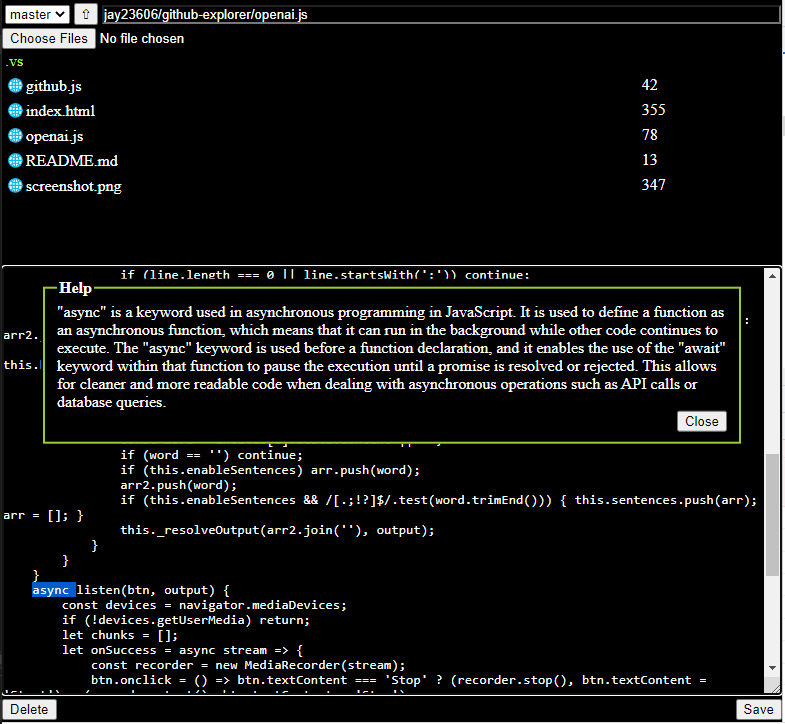

# github-explorer

Vanilla JS github file explorer/editor using a text input field and an "up" button to navigate directories and a textarea to make edits.

To add files just type the name of the file you want in the text input field (can also create directories this way).

Also added a feature to upload multiple files and it is all client-side.

Requires github API token with repo access to be entered which is stored in localStorage.

